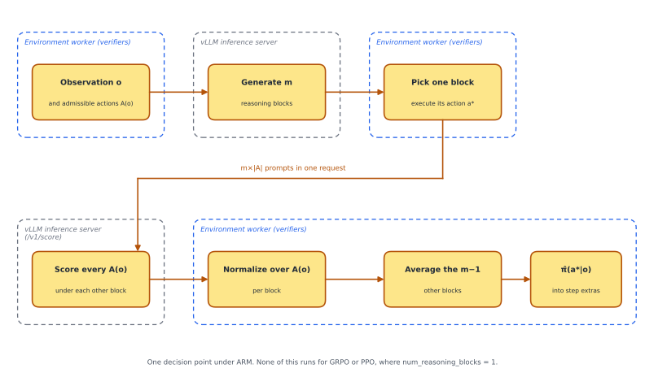

# ALFWorld for verifiers, with context truncation and ARM rollout support

## 0. Summary

Upstream verifiers is Prime Intellect's environment library for RL on language models. An environment defines how a rollout runs and how it is scored. This fork adds one environment, ALFWorld, a text-based household task benchmark. It also adds two features upstream does not have. One, context-window truncation, so that a long episode keeps running when its history outgrows the model's window instead of ending. Two, rollout-side support for ARM, the per-decision credit assignment method in the companion [prime-rl fork](https://github.com/sbconlon/prime-rl). I built it for an MSc thesis on credit assignment under context truncation. The results and the theory are in the [writeup](https://github.com/sbconlon/prime-rl/blob/main/docs/arm-writeup.pdf).

## 1. The ALFWorld environment

ALFWorld is a text-based household environment. The agent reads a text observation and issues a text command toward a goal like "put some toiletpaper on shelf." There are six task types (pick and place, clean, heat, cool, examine, pick two), 3,553 training games, and validation splits of 140 seen and 239 unseen games.

`ALFWorldEnvironment` is a `MultiTurnEnv`. Every observation lists the admissible commands and ends with a reminder that reinforces the action output format. The command is read from the action tags. When the response is malformed and no action can be found, the environment falls back to `look`, which spends the turn without changing the game. A command that is not admissible goes to the game anyway, which answers "Nothing happens." and spends the turn. The reward is terminal and binary, 1.0 on success and 0.0 otherwise. The episode ends on success or at `max_turns`.

`load_environment` takes these arguments.

| Argument | Default | What it does |
|---|---|---|
| `data_path` | `~/.cache/alfworld/json_2.1.1` | root of the ALFWorld game files |
| `split` | `"train"` | `train`, `valid_seen` or `valid_unseen` |
| `max_turns` | `50` | turn cap per episode |
| `max_context_tokens` | `-1` | token budget for the prompt, `-1` is off, see Section 2 |
| `num_reasoning_blocks` | `1` | reasoning blocks per turn, above 1 turns on ARM support, see Section 3 |
| `tokenizer_path` | `None` | tokenizer for token counting, required for LoRA runs |
| `curriculum`, `task_types` | `None` | per-stage task-type weights, or a fixed task-type filter |
| `log_trajectories` | `"none"` | `"wins"` or `"all"` writes readable episode logs |
| `use_nm_fusion`, `prewarm_pi_hat_prefixes`, `use_score_route` | `True` | ARM scoring performance switches, see Section 3 |

As an episode plays out, the environment records more than a plain verifiers environment does. It writes three truncation counters into state (Section 2) and, under ARM, three keys into each step's extras (Section 3). It also reports four zero-weight metrics, `context_truncated`, `context_evictions`, `admissible_action_rate` and `format_compliance_rate`.

**Figure 1.1.** One turn, taken from a logged training rollout.

```text
user:
You arrive at toiletpaperhanger 1. On the toiletpaperhanger 1, you see a toiletpaper 1.

Your admissible actions for this step are:
examine toiletpaperhanger 1
go to bathtubbasin 1
go to garbagecan 1
go to handtowelholder 1
go to shelf 1
go to shelf 2
go to shelf 3
go to sinkbasin 1
go to toilet 1
go to towelholder 1
help
inventory
look
take toiletpaper 1 from toiletpaperhanger 1

Now it's your turn. Respond with EXACTLY this format:
<think>your reasoning here</think>
<action>your chosen action here</action>

Use the literal angle-bracket tags shown above. Do NOT use square brackets -- the format must be <action>command</action>, NOT [action]command[/action].

assistant:
<think>I have found the toiletpaper. Now I need to take it and put it on one of the shelves.</think>
<action>take toiletpaper 1 from toiletpaperhanger 1</action>
```

## 2. Context truncation

What changed: upstream ends an episode when the prompt no longer fits the model's window. This fork keeps the episode running by dropping the oldest turns.

Upstream, when vLLM rejects a prompt as too long, `OpenAIChatCompletionsClient` raises `OverlongPromptError`, and `MultiTurnEnv.rollout` catches it, marks the episode `is_truncated` and stops. Every long episode ends that way, with reward 0.

The fork overrides `get_prompt_messages`. After the base class builds the message list, `_apply_sliding_window` counts the tokens and, while the count is over `max_context_tokens`, evicts the oldest turn and recounts. A turn is evicted as a prompt-response pair, so a response never outlives its prompt. The system prompt is always kept. The first task observation is not. Once it is gone the agent can lose sight of the goal, which is the partial observability the thesis studies.

Tokens are counted with a local Hugging Face tokenizer, loaded once per worker by `_ensure_tokenizer` from `tokenizer_path` or else the served model name, with the chat template applied as vLLM applies it. It is local so that counting never touches the inference server. An earlier version called vLLM's `/tokenize` endpoint every turn. Under 64 concurrent rollouts that put tokenizer load on the one process everything else waits on, and counting locally takes it off.

**Figure 2.1.** The keys the environment keeps in state.

| Key | Meaning |
|---|---|
| `context_truncated` | whether any eviction happened this episode |
| `context_truncated_at_turn` | trajectory step index of the first eviction |
| `context_evictions` | running count of evictions this episode |
| `won` | set on the terminal step, read by the reward |
| `num_admissible`, `num_format_compliant` | per-turn tallies behind the two rate metrics |

`max_context_tokens = -1`, the default, turns the mechanism off and leaves upstream behavior unchanged. If token counting fails, the turn proceeds untruncated with a warning, and vLLM may still reject it.

## 3. Rollout support for ARM

What changed: nothing, unless `num_reasoning_blocks` is greater than 1. Then each turn generates several reasoning blocks, executes one, and estimates the policy's probability of the executed action.

ARM in the prime-rl fork needs the probability the policy assigns to the environment action it took. If the response were just the action, that would be the sum of its token logprobs. But the response is a reasoning block followed by the action, so the action is conditioned on the observation and on the reasoning block that preceded it.

What we want is

$$\pi(a \mid o)$$

What we can measure is

$$\pi(a \mid o, R)$$

for one reasoning block R. To get from one to the other we would marginalize over every reasoning block the model could have written, but that set is far too large. So the environment samples m blocks and averages, a Rao-Blackwellized estimate.

$$\pi(a \mid o) \approx \frac{1}{m} \sum_{j=1}^{m} \pi(a \mid o, R_j)$$
 The block that produced the executed action is held out of the average, because it chose that action and would inflate its share. That is the estimate. The rest of this section is how it is computed.

**Generation.** `get_model_response` is overridden. At `num_reasoning_blocks = 1` it is a passthrough to the base class, so GRPO and PPO rollouts are untouched. Above 1 it asks vLLM for m responses to the same prompt in one request, so the observation is prefilled once. If the server cannot do that, it falls back to m separate requests. It executes one of them, chosen at random, and keeps the rest for scoring.

**Scoring.** For each block, the environment builds one continuation per admissible action and scores them all. It renormalizes the scores over the admissible set, which gives P(a | o, R_j) for every action under that block. It takes the executed action's share and averages it over the blocks other than the one that produced it. That average is π̂.

The transport is one request per decision point carrying all m×|A| prompts. Before scoring, the environment sends each observation-plus-reasoning prefix to the server once, so the prompts hit vLLM's cache instead of recomputing it. The prompts go to the `/v1/score` route on the prime-rl inference server, which returns one summed logprob per prompt, and fall back to `/v1/completions` with `prompt_logprobs` if the route is missing. The runs used m = 2.

**Contract.** Each step's extras get three keys, `admissible_actions`, `executed_action` and `pi_hat`. The prime-rl orchestrator builds a `DecisionPoint` from them and adds the executed action to the admissible set when it is missing. On an error turn, or when scoring fails, `pi_hat` is left unset and logged as such, and the prime-rl side zeroes that decision's advantage.

**Figure 3.1.** One decision point under ARM. None of this runs when `num_reasoning_blocks = 1`. Shared with the prime-rl README.



## 4. How to run

Install the environment package from this repo's root. For training, install it into the prime-rl fork's venv after that repo's `uv sync`, which wipes outside packages.

```bash
vf-install alfworld
cd /path/to/prime-rl && uv pip install -e /path/to/verifiers/environments/alfworld
```

The `alfworld` package's downloader fills `~/.cache/alfworld/json_2.1.1/` with one directory per trial holding a `game.tw-pddl`. That is what `data_path` points at.

```bash
alfworld-download
```

Run an evaluation against a served model.

```bash
prime eval run alfworld-env -m <served-model> -b http://localhost:8000/v1 \
  -a '{"data_path": "~/.cache/alfworld/json_2.1.1", "split": "valid_seen", "max_context_tokens": 2048}' \
  -n 50 -r 8 -s -C context_truncated_at_turn
```

`-a` passes the environment arguments, `-s` saves the results, and `-C` persists a state key. The other two counters are already saved as metrics.

Run the spike against the same server first.

```bash
python environments/alfworld/scripts/spike_score_consistency.py --base-url http://localhost:8000/v1 --model <served-model>
```

Run the tests.

```bash
uv run pytest environments/alfworld
```

49 tests collect and 48 pass in about six seconds. The failure is a wording assertion in `test_prompting.py`, and `test_sliding_window.py` fails to collect on a stale hardcoded path. Training runs are launched from the prime-rl fork, see [Section 6 of its README](https://github.com/sbconlon/prime-rl#6-how-to-run).

## 5. Status

The thesis used this environment three ways. GRPO at a 16k and a 2k window, the truncation comparison. The ARM runs, at a 2k window with m = 2. And the warm-start data, SFT-policy rollouts at m = 1. The numbers are in the writeup.

One limitation. ARM did not train stably on ALFWorld, and the writeup has the diagnosis.

Upstream is Prime Intellect's [verifiers](https://github.com/PrimeIntellect-ai/verifiers), MIT licensed, and the license is inherited. This is the code for the MSc thesis "Beyond Trajectory-Level Credit Assignment: Counterfactual Regret Minimization for LLMs", Bocconi University, advised by Martino Banchio, defended July 2026.

## 6. Where things live

| Component | Path |
|---|---|
| Environment class and `load_environment` | `environments/alfworld/alfworld_env.py` |
| Truncation, `get_prompt_messages`, `_apply_sliding_window`, `_count_tokens` | `environments/alfworld/alfworld_env.py` |
| m-block generation, `get_model_response`, `_generate_m_blocks_fused` | `environments/alfworld/alfworld_env.py` |
| Scoring wiring, `add_trajectory_step`, `_compute_pi_hat`, `_score_continuations` | `environments/alfworld/alfworld_env.py` |
| RBMC math, `conditional_renorm`, `rbmc_marginal_loo` | `environments/alfworld/rbmc.py` |
| Token client scoring primitive, `token_client.post` | `verifiers/clients/openai_chat_completions_token_client.py` |
| Upstream truncation failure, `OverlongPromptError` | `verifiers/clients/openai_chat_completions_client.py`, `verifiers/envs/multiturn_env.py` |
| Score-consistency spike | `environments/alfworld/scripts/spike_score_consistency.py` |
| Tests | `environments/alfworld/test_*.py` |
| Environment package | `environments/alfworld/pyproject.toml` |
| Shared figure | `docs/assets/fig1-2-scoring-path.svg` |
